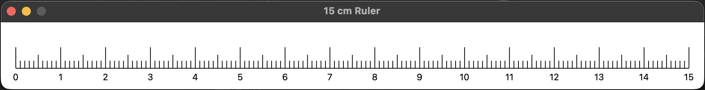

# RulerApp


Simple 15 cm ruler for Macbook Pro.
Works in any screen resolution.
Tested on M1 Max Macbook Pro.

## Build instructions

### 1. Install dependancies
#### with conda:
```shell
conda install -c conda-forge pyobjc-framework-cocoa pyobjc-framework-quartz pyinstaller
```

#### or with pip:
```shell
pip install pyobjc pyinstaller
```

### 2. Build the application
```shell
pyinstaller --noconfirm --clean --onedir --windowed ruler.py
```

Find Ruler.app in the `./dist` folder.


---
### If you want to rebuild the application:
```shell
rm -rf build dist *.spec
pyinstaller --noconfirm --clean --onedir --windowed ruler.py
```
